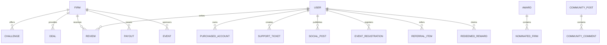

# MASTER BACKEND & ADMIN SPECIFICATION — EMPIRIAL 2.0

> **DOCUMENT PURPOSE & IMPLEMENTATION DIRECTIVE**  
> This specification is the single source of truth for engineering the complete **Firebase Backend (Firestore, Storage, Authentication, Cloud Functions, Security Rules)**, **Data Layer**, and **Full-Featured Admin Panel / CMS** for the **EMPIRIAL 2.0** prop trading intelligence platform.
> 
> **CRITICAL ENVIRONMENT NOTE**:  
> No backend code is to be implemented on this machine. This specification has been compiled by analyzing the live source code across all pages, layouts, components, modals, stores, and mock data. Another developer or AI on a separate system will build the backend and Admin Panel using strictly this document and their own Firebase environment credentials.
>
> **DESIGN PRESERVATION MANDATE**:  
> The existing frontend UI design (monochrome black/white theme, typography, cards, badges, radar charts, modals, haptic animations, glowing light beams) must remain pixel-perfect and unmodified. The backend integration replaces mock states behind the existing components.

---

## TABLE OF CONTENTS
1. [Project Overview](#1-project-overview)
2. [Current Technology Stack](#2-current-technology-stack)
3. [Complete Route List](#3-complete-route-list)
4. [Complete Page Inventory & UI Breakdown](#4-complete-page-inventory--ui-breakdown)
5. [Complete Component Analysis](#5-complete-component-analysis)
6. [Hardcoded Content Audit & Classification](#6-hardcoded-content-audit--classification)
7. [Dynamic Content & Editability Architecture](#7-dynamic-content--editability-architecture)
8. [User Features & Interaction Flow Diagrams](#8-user-features--interaction-flow-diagrams)
9. [Firestore Database Collections Directory](#9-firestore-database-collections-directory)
10. [Exhaustive Firestore Document Schemas](#10-exhaustive-firestore-document-schemas)
11. [Entity Relationship Architecture](#11-entity-relationship-architecture)
12. [Firebase Storage Architecture](#12-firebase-storage-architecture)
13. [Authentication Architecture](#13-authentication-architecture)
14. [Authorization & Role-Based Access Control (RBAC)](#14-authorization--role-based-access-control-rbac)
15. [Firestore Security Rules Specification](#15-firestore-security-rules-specification)
16. [Firebase Storage Security Rules Specification](#16-firebase-storage-security-rules-specification)
17. [Admin Panel Sitemap & Route Directory](#17-admin-panel-sitemap--route-directory)
18. [Admin Panel CRUD & Action Specifications](#18-admin-panel-crud--action-specifications)
19. [Homepage & Custom Page Builder CMS Specification](#19-homepage--custom-page-builder-cms-specification)
20. [Media & Asset Manager Specification](#20-media--asset-manager-specification)
21. [SEO & Metadata Manager Specification](#21-seo--metadata-manager-specification)
22. [Public Page to Firestore Data Mapping](#22-public-page-to-firestore-data-mapping)
23. [Admin to Firebase to Public UI Data Flows](#23-admin-to-firebase-to-public-ui-data-flows)
24. [User to Firebase Data Flows](#24-user-to-firebase-data-flows)
25. [Frontend API & Data Service Layer Requirements](#25-frontend-api--data-service-layer-requirements)
26. [Input Validation & Sanitization Specifications](#26-input-validation--sanitization-specifications)
27. [Error Handling & Fallback Strategy](#27-error-handling--fallback-strategy)
28. [Loading & Skeleton States](#28-loading--skeleton-states)
29. [Responsive & Mobile Behavior Constraints](#29-responsive--mobile-behavior-constraints)
30. [Production Security Requirements](#30-production-security-requirements)
31. [Performance, Caching & Scalability Strategy](#31-performance-caching--scalability-strategy)
32. [Safe Sequential Implementation Roadmap](#32-safe-sequential-implementation-roadmap)
33. [Automated & Manual Verification Requirements](#33-automated--manual-verification-requirements)
34. [Deployment & Environment Configuration](#34-deployment--environment-configuration)
35. [Comprehensive Admin Field Matrix](#35-comprehensive-admin-field-matrix)

---

## 1. PROJECT OVERVIEW
**EMPIRIAL 2.0** is an institutional-grade proprietary trading intelligence platform engineered by **ANURAJ FX**. It provides retail and professional prop traders with:
- Forensic evaluation challenge auditing (13+ comparison parameters: profit targets, daily loss, max trailing/static drawdowns, profit splits, refund policies, consistency rules, news restrictions).
- Verified coupon aggregator and BOGO/cashback flash deal telemetry with copy-to-claim safeguards.
- Forensic payout verification system with cryptographic transaction hash checks and payment receipt audits.
- Multi-broker raw spread monitoring matrix across major forex pairs, metals, indices, and crypto.
- Annual Trader Choice Awards with authentic community voting.
- Community Social Feed ("State Hall") with category filtering, creator verification badges, pinned announcements, and upvote/downvote mechanics.
- Complete Trader Profile Hub with purchased account trackers, review submission, tournament pass registration, real-time two-way support messaging, and a referral reward redemption store.
- High-converting session welcome modal ("Offer Poster Modal") for limited-time flash sales.

---

## 2. CURRENT TECHNOLOGY STACK
- **Framework**: Next.js 15.2.1 (App Router)
- **Runtime / UI Library**: React 19.0.0 & React DOM 19
- **Language**: TypeScript 5.8.2
- **Styling**: Tailwind CSS 3.4.17 with custom monochrome theme tokens (`elevation-base`, `elevation-surface`, `elevation-card`, `elevation-overlay`)
- **Theme**: `next-themes` (Dark Mode default with toggle support)
- **Motion & UI Primitives**: 
  - Framer Motion 13.1.1 (Smooth transitions, exit animations, shake vibrations)
  - Radix UI (@radix-ui/react-accordion, dialog, dropdown-menu, navigation-menu, separator, slot, tooltip, icons)
  - Lucide React 1.16.0 (Icons)
  - NumberFlow (@number-flow/react 0.6.2 for animated statistics counters)
- **Backend Services**: Firebase JS SDK 12.18.0 (Client) & Firebase Admin 14.3.0 (Server/Admin)

---

## 3. COMPLETE ROUTE LIST

### 3.1 Public User Routes
| Path | File Location | Purpose |
|------|--------------|---------|
| `/` | `app/page.tsx` | Main Homepage (Hero, Verified Firms marquee, Pricing table, Stats, Testimonials, FAQs, Footer) |
| `/firms` | `app/firms/page.tsx`, `app/firms/FirmsClient.tsx` | Prop Firms Directory with category filters, platforms, allocation slider, and copy-first claim |
| `/firms/[slug]` | `app/firms/[slug]/page.tsx`, `FirmProfileClient.tsx` | Prop Firm Profile Hub (5 tabs: Rules & Specs, Challenges, Promo Deals, Reviews, Payouts) |
| `/challenges` | `app/challenges/page.tsx`, `ChallengesClient.tsx` | 13-Column Evaluation Challenge Matrix with account size filters, multi-firm selector, and sorting |
| `/deals` | `app/deals/page.tsx`, `DealsClient.tsx` | Verified Discount Codes & BOGO Offers Catalog with haptic copy buttons and affiliate redirects |
| `/offers` | `app/offers/page.tsx` | Alias/Redirect to Deals catalog |
| `/events` | `app/events/page.tsx`, `EventsClient.tsx` | Tournaments, Gaming & Bootcamps Hub with task registration, screenshot proofs, and ticket passport |
| `/compare` | `app/compare/page.tsx`, `CompareClient.tsx` | Side-by-side comparison engine with Radar Chart scoring (up to 4 firms/challenges) |
| `/reviews` | `app/reviews/page.tsx`, `ReviewsClient.tsx` | Verified Trader Reviews with multi-rating criteria (Trading, Support, Payout, Usability) and submission |
| `/payouts` | `app/payouts/page.tsx`, `PayoutsClient.tsx` | Forensic Payout Proofs Grid with modal image zoom, regional/concept filters, and user upload form |
| `/spreads` | `app/spreads/page.tsx`, `SpreadsClient.tsx` | Live Broker Spreads Matrix with raw pips, commissions, and effective lot cost calculation |
| `/awards` | `app/awards/page.tsx`, `AwardsClient.tsx` | Annual Industry Awards voting hub with authenticated live vote incrementing |
| `/blog` | `app/blog/page.tsx` | State Hall (Trader Social Feed & Knowledge Hub) |
| `/blog/[slug]` | `app/blog/[slug]/page.tsx` | Single Blog Post / Strategic Guide with author bios and markdown content |
| `/community` | `app/community/page.tsx`, `CommunityClient.tsx` | Community Discussions Forum with nested comments and voting |
| `/profile` | `app/profile/page.tsx`, `ProfileClient.tsx` | Trader Dashboard (Accounts, Reviews, Event Passes, Support Tickets, Referrals & Rewards Store) |
| `/about` | `app/about/page.tsx` | Platform Mission, Audit Methodology, and Executive Leadership |
| `/affiliate-program` | `app/affiliate-program/page.tsx` | 15% Partner Commission Program details |
| `/announcements` | `app/announcements/page.tsx` | Official announcements feed (maps to State Hall) |
| `/contact` | `app/contact/page.tsx` | Contact & Audit Request form with topic categorization |
| `/demo-accounts` | `app/demo-accounts/page.tsx` | Free 14-day practice trial combine links |
| `/how-it-works` | `app/how-it-works/page.tsx` | 3-Step Trader Roadmap guide |
| `/leaderboard` | `app/leaderboard/page.tsx` | Performance Hall of Fame (Top 8 audited traders with podium rankings) |
| `/loyalty` | `app/loyalty/page.tsx` | Trader Points & Rewards Catalog with milestone tier progress |
| `/pricing` | `app/pricing/page.tsx` | 3-tier membership plan selection (Hobby, Pro, Enterprise) |
| `/privacy-policy` | `app/privacy-policy/page.tsx` | Data protection and legal compliance policy |
| `/rule-changes` | `app/rule-changes/page.tsx` | Prop firm historical rule modification changelog |
| `/rules` | `app/rules/page.tsx` | Compliance guide (Balance vs Equity drawdown, lot limits, news rules) |
| `/terms-and-conditions` | `app/terms-and-conditions/page.tsx` | Terms of service |
| `/transparency` | `app/transparency/page.tsx` | 4 Fundamental Commitments & Anti-Bias standards |
| `/[category]` | `app/[category]/page.tsx` | Dynamic Category Landing Page (forex, futures, crypto, instant-funding) |
| `/[category]/challenges` | `app/[category]/challenges/page.tsx` | Filtered challenge table by category |
| `/[category]/deals` | `app/[category]/deals/page.tsx` | Filtered promo deals by category |
| `not-found` | `app/not-found.tsx` | 404 Error page with return home CTA |

### 3.2 Admin Routes
| Path | File Location | Purpose |
|------|--------------|---------|
| `/admin/login` | `app/admin/login/page.tsx` | Secure Admin Authentication with email/password and session lock |
| `/admin` | `app/admin/page.tsx` | Admin Dashboard metrics (Firms, Challenges, Deals, Payouts, Reviews counters) |
| `/admin/firms` | `app/admin/firms/page.tsx` | Prop Firms Directory CRUD, featured toggles, rules & scaling management |
| `/admin/challenges` | `app/admin/challenges/page.tsx` | Challenge Account Catalog CRUD (pricing, drawdown parameters, buy URLs) |
| `/admin/deals` | `app/admin/deals/page.tsx` | Promo Deals & BOGO coupons manager (clicks tracking, expiration, discount tags) |
| `/admin/payouts` | `app/admin/payouts/page.tsx` | Payout Proofs Audit Queue (approve/verify, delete, amount, proof image) |
| `/admin/reviews` | `app/admin/reviews/page.tsx` | Reviews Moderation Desk (publish/unpublish, reply to review, verify trader) |
| `/admin/social` | `app/admin/social/page.tsx` | State Hall Creator Verification Desk & Broadcast Publisher (approve/reject creators, pin/delete posts) |
| `/admin/events` | `app/admin/events/page.tsx` | Tournaments, Giveaways & Bootcamps manager (tasks, prize breakdown, registrations) |
| `/admin/awards` | `app/admin/awards/page.tsx` | Annual Awards Manager (nominate firms, toggle voting, manual vote tallying) |
| `/admin/blog` | `app/admin/blog/page.tsx` | Blog / Strategy Guide CMS (markdown editor, cover image, category, author) |
| `/admin/loyalty` | `app/admin/loyalty/page.tsx` | Loyalty Rewards Store inventory (vouchers, merch, coaching stock & points cost) |
| `/admin/spreads` | `app/admin/spreads/page.tsx` | Live Broker Spreads editor (pips, commissions, status per pair) |
| `/admin/market-ticker` | `app/admin/market-ticker/page.tsx` | Live Ticker editor (EUR/USD, Gold, BTC, US30 prices and 24h change) |
| `/admin/messages` | `app/admin/messages/page.tsx` | Two-Way Trader Support Ticket Inbox (view message history, reply, set ticket status) |
| `/admin/page-builder` | `app/admin/page-builder/page.tsx` | Homepage & Section Copy CMS (hero headlines, CTAs, trust stats) |
| `/admin/media` | `app/admin/media/page.tsx` | Firebase Storage Media Library (upload logos, banners, receipts, copy URLs) |
| `/admin/settings` | `app/admin/settings/page.tsx` | Global Settings, Brand Name, Maintenance mode, and Offer Popup toggle |

---

## 4. COMPLETE PAGE INVENTORY & UI BREAKDOWN

### 4.1 Homepage (`/`)
- **File**: `app/page.tsx`
- **Sections**:
  1. `Hero` (`components/hero.tsx`): Main heading with gradient text, subtitle, Primary CTA button ("GRAB OFFERS"), Secondary CTA button ("Join Discord"), decorative tilted blue atmospheric light beam.
  2. `Partners` (`components/partners.tsx`): "Verified Firms" logo marquee grid with tooltip company names (Alpha Capital, CK Capital, GTF, NYS Capital, Pipstone, Shark Funded, Sure Leverage, etc.).
  3. `Pricing` (`components/pricing.tsx`): 3-column pricing/deal comparison card with shake animation warning if user clicks "Buy Challenge" before copying code, profit split, drawdowns, discount tags, and active coupon codes.
  4. `Stats` (`components/stats.tsx`): 4-column animated counter using `@number-flow/react` (Active Traders: 50K+, Listed Firms: 40+, Community Reviews: 12K+, Active Challenges: 150+).
  5. `Testimonials` (`components/testimonials.tsx`): Expandable grid of trader reviews with avatar initials, company/role, star ratings, and full feedback.
  6. `Faq` (`components/faq.tsx`): 5-item accordion answering key user questions (Verification methodology, coupon guarantee, drawdown calculations, loyalty points, Discord community).
  7. `Footer` (`components/footer.tsx`): Brand logo, tagline, quick links, social media buttons (Twitter, GitHub), copyright year, and hashtag `#BuildingEmpires`.
  8. `OfferPosterModal` (`components/offer-poster-modal.tsx`): Triggered once per browser session with countdown, discount badge, coupon code, benefit bullet points, and affiliate enrollment button.
- **Admin Requirements**:
  - Edit hero headline, subtitle, and CTA button text/links.
  - Upload and manage partner firm logos in the marquee.
  - Edit featured pricing cards, account size options, drawdown types, and discount coupons.
  - Edit numerical stats counters and suffixes.
  - Add, edit, reorder, and remove testimonials.
  - Add, edit, reorder, and remove FAQ accordion items.
  - Manage footer brand text, social URLs, and copyright strings.
  - Toggle and customize the session Welcome Offer Poster Modal (image, title, coupon, link, benefits list).

### 4.2 Prop Firms Directory (`/firms`)
- **File**: `app/firms/page.tsx`, `app/firms/FirmsClient.tsx`
- **Sections**:
  1. Top Banner: Title ("Prop Firms Directory"), subtitle, search bar.
  2. Filter Drawer & Toolbar: Category tabs (All, Forex, Futures, Crypto, Instant Funding), sorting dropdown (Popular, Best Value, Rating), platform filter (MT5, cTrader, Match-Trader, TradeLocker, NinjaTrader, Tradovate, TradingView, Bookmap, ATAS, Deepcharts, MultiCharts), trading model filter (1-Step, 2-Step, Instant), min allocation slider ($0 to $2.5M).
  3. Firm Cards Grid:
     - Firm Logo, Name, Trust Score badge (e.g. 99/100), Audited badge, Founded year, HQ country.
     - Metrics: Max Allocation, Profit Split (e.g. Up to 90%), Payout Frequency (e.g. Bi-Weekly / 6hr SLA), Rating & Review Count.
     - Interactive Features: Expandable details drawer, Copy Code button with vibration, "Claim Offer" / "View Challenges" button (enforces copy-code-first interaction).
- **Admin Requirements**:
  - Full CRUD on Prop Firms (Name, slug, logo URL, rating, review count, trust score, max allocation, profit split, payout schedule, discount badge, coupon code, platforms, category, featured/popular/verified flags, HQ, rules text, restricted countries, scaling programs).

### 4.3 Prop Firm Profile Hub (`/firms/[slug]`)
- **File**: `app/firms/[slug]/page.tsx`, `app/firms/[slug]/FirmProfileClient.tsx`
- **Sections**:
  1. Identity Header: Large Firm Logo, Name, Audited badge, Description, HQ, Platforms list, Trust score badge, Copy Coupon button, "Compare Specs" link.
  2. Highlight Ribbon: 4 quick metrics (Max Allocation, Profit Split, Payout Schedule, Rating).
  3. 5-Tab Navigation:
     - **Tab 1 (Rules & Specs Overview)**: Consistency & Risk Policies card, Drawdown & Evaluation rules card, Payout Scaling Program table, Restricted Jurisdictions pill list, Active Promo highlight card.
     - **Tab 2 (Challenges)**: Grid of all challenges tied to this firm (Name, Steps badge, Profit split gauge, Max loss, Profit target, Strike price, Buy Challenge CTA).
     - **Tab 3 (Promo Deals)**: Grid of discount promo codes, BOGO deals, and cashback badges with Copy buttons.
     - **Tab 4 (Reviews & Ratings)**: Trader reviews specifically for this firm with star ratings, verified badges, and dates.
     - **Tab 5 (Payout Proofs)**: Audited payout proofs for this firm with trader name, amount, date, payment method, and trading concept.
- **Admin Requirements**:
  - Update all firm master details, rules text, scaling tables, and restricted countries.
  - Link/unlink challenges, deals, reviews, and payouts to this firm.

### 4.4 Evaluation Challenges Matrix (`/challenges`)
- **File**: `app/challenges/page.tsx`, `app/challenges/ChallengesClient.tsx`
- **Sections**:
  1. Matrix Header: Title, subtitle, search input.
  2. Filter Sidebar / Drawer: Multi-select firm checklist with firm logos, account size pills ($5K, $10K, $25K, $50K, $100K, $200K, $300K, $500K+), steps selector (1-Step, 2-Step, 3-Step, Instant), category tabs, and sort dropdown (Lowest Price, Highest Allocation, Best Value, Popular).
  3. 13-Column Comparison Table / Cards:
     - Firm Logo & Name
     - Account Size
     - Challenge Name & Steps
     - Price & Strike Original Price
     - Profit Split Percentage (with gauge)
     - Daily Loss Limit Percentage
     - Max Loss Limit Percentage (Trailing vs Static)
     - Profit Target Percentage (Phase 1 & Phase 2)
     - Min Trading Days & Max Trading Days
     - Payout Frequency (e.g. 5 Days, Bi-Weekly, Daily)
     - Leverage (e.g. 1:100, 1:30)
     - Refundable Fee Indicator
     - Action: Copy Code + Buy Challenge button (with copy safeguard)
- **Admin Requirements**:
  - Full CRUD on Challenges (firm_id, name, account_size, steps, price, original_price, profit_split_pct, daily_loss_limit_pct, max_loss_limit_pct, profit_target_pct, phase_2_target_pct, min_trading_days, max_trading_days, payout_frequency, leverage, refundable_fee, buy_url, coupon_code, discount_pct, category, is_featured, is_best_seller, loss_type, rules).

### 4.5 Verified Deals & Promo Codes (`/deals` & `/offers`)
- **File**: `app/deals/page.tsx`, `app/deals/DealsClient.tsx`
- **Sections**:
  1. Header & Live Telemetry Badge: "100% VERIFIED DISCOUNTS AUDITED HOURLY".
  2. Filter Tabs: All Deals, BOGO Deals, Cashback, Fee Refunds, Direct Discounts.
  3. Deals Grid:
     - Firm Logo, Name, Rating & Reviews.
     - Discount Label & Percentage Badge (e.g. `BOGO: Buy One Get Two Free`, `200% Refund on First Payout`, `-25% OFF`).
     - Description of promo terms and expiration date countdown.
     - Coupon Code box with haptic Copy button.
     - "Claim Offer" button (enforces copy-first interaction before redirecting to affiliate link).
- **Admin Requirements**:
  - Full CRUD on Deals (firm_id, code, discount_label, discount_pct, description, category, affiliate_url, expires_at, is_featured, is_verified, offer_type: 'bogo'|'cashback'|'refund'|'discount', offer_badge, refund_pct, cashback_pct, is_bogo, account_size, eval_type, profit_target, drawdown, profit_split, original_price, offered_price, payout_frequency).
  - Telemetry: Track and view `clicks_count`.

### 4.6 Tournaments, Events & Giveaways (`/events`)
- **File**: `app/events/page.tsx`, `app/events/EventsClient.tsx`
- **Sections**:
  1. Top Banner: Title ("Trader Tournaments & Event Hub"), Category Tabs (All, Giveaways, Events).
  2. Sub-Category Pills: Tournaments, Gaming, Learn & Crack, Live Sessions, Bootcamps.
  3. Event Cards Grid:
     - Poster Image / Firm Banner.
     - Firm Logo & Host Name (e.g. "NYS Capital & EMPIRIAL").
     - Prize Pool Highlight (e.g. "$250,000 in Accounts + $50,000 Cash").
     - Start / End Date with live countdown label (e.g. "Starts in 4 Days").
     - Entry Fee Badge ("FREE" or Paid with amount).
     - Participant count counter.
     - Description, Prize Breakdown list (1st, 2nd, 3rd, Top 50 rewards), Rules list, Schedule.
     - Discord Verification Task checklist (e.g. "Join Discord", "Submit cTrader ID").
     - Screenshot Proof Upload input.
     - "Register Now" / "Get Passport" CTA with flying trophy celebration animation and email confirmation toast.
- **Admin Requirements**:
  - Full CRUD on Events (title, slug, category, sub_category, type, entry_type, entry_fee, is_firm_sponsored, firm_id, host_name, host_firm, prize_pool, prize_amount_usd, start_date, end_date, countdown_label, participants_count, max_participants, popularity_score, registration_url, poster_url, is_active, is_featured, description, rules, schedule, prizes_breakdown, requires_discord, discord_url, registration_tasks).

### 4.7 Comparison Engine (`/compare`)
- **File**: `app/compare/page.tsx`, `app/compare/CompareClient.tsx`
- **Sections**:
  1. Mode Selector: Compare Firms vs Compare Challenges.
  2. Up to 4-Slot Multi-Selector with firm search dropdown.
  3. Interactive SVG Radar Chart visualizing 5 core metrics (Drawdown Safety, Payout Speed, Profit Split, Spread Efficiency, Trust Score).
  4. Deep Comparison Table comparing 20+ parameters side-by-side.
- **Admin Requirements**:
  - Data is derived from `firms` and `challenges` collections. No separate collection needed; updating firm/challenge documents automatically recalculates comparison metrics.

### 4.8 Verified Trader Reviews (`/reviews`)
- **File**: `app/reviews/page.tsx`, `app/reviews/ReviewsClient.tsx`
- **Sections**:
  1. Header with "Submit Review" action button (opens auth modal if disconnected).
  2. Multi-Select Firm filter bar.
  3. Reviews Grid:
     - Review Title, 5-Star Rating, Date, Upvotes counter.
     - Breakdown ratings: Trading Conditions, Customer Care, Usability, Payout Process.
     - User Full Name & Verified Trader Badge.
     - Review text body.
  4. Write Review Modal:
     - Firm selector, Full name, Review Title, Body text, 4 Star rating sliders (1-5), Submit button.
- **Admin Requirements**:
  - Full CRUD & Moderation on Reviews (Approve/Publish, Edit, Delete, add Official Firm Reply).

### 4.9 Forensic Payout Proofs (`/payouts`)
- **File**: `app/payouts/page.tsx`, `app/payouts/PayoutsClient.tsx`
- **Sections**:
  1. Header with Total Audited Payouts Counter ($15.2M+) and "Upload Proof" button.
  2. Filters: Region (India, UAE, USA, Europe, Asia, Global), Trading Concept (ICT/SMC, Price Action, Scalping, Algorithmic EA, Swing), Firm selector.
  3. Payout Proofs Grid:
     - Firm Logo, Trader Name, Payout Amount ($), Payout Date.
     - Region, Concept, Account Size, Payment Method (Rise, Crypto, Wire).
     - Proof Image Preview with full-screen zoom modal on click.
     - Verified audit badge.
  4. Upload Proof Modal:
     - Trader Name, Payout Amount, Firm Name, Region, Trading Concept, Payment Proof Image file uploader.
- **Admin Requirements**:
  - Moderate payout submission queue (approve/verify, reject/delete, edit metadata, upload audited proof screenshots).

### 4.10 Live Broker Spreads Matrix (`/spreads`)
- **File**: `app/spreads/page.tsx`, `app/spreads/SpreadsClient.tsx`
- **Sections**:
  1. Header: Live Liquidity & Execution Benchmarks badge, description.
  2. Instrument Filter Tabs: All, EURUSD, GBPUSD, XAUUSD, BTCUSD, US30.
  3. Spreads Table:
     - Broker / Liquidity Feed name
     - Symbol / Pair
     - Raw Spread (Pips)
     - Commission ($/Lot)
     - Calculated Effective Cost per Standard Lot: `(spread_pips * 10) + commission_per_lot`
     - Account Type (Raw Spread, Zero Commission, High Stakes)
     - Platform (cTrader, MT5, Match-Trader)
     - Status badge (Active Live Feed)
- **Admin Requirements**:
  - Full CRUD on Broker Spreads (broker_name, pair, spread_pips, commission_per_lot, account_type, platform, is_active).

### 4.11 Industry Awards 2026 (`/awards`)
- **File**: `app/awards/page.tsx`, `app/awards/AwardsClient.tsx`
- **Sections**:
  1. Header: Annual Trader Choice Awards 2026.
  2. Award Categories Grid:
     - Category Title (e.g. "Best Overall Prop Firm of the Year 2026", "Fastest & Most Reliable Payouts 2026", "Best Futures Prop Firm 2026").
     - Description.
     - Nominated Firms list with Logos, Live Vote Counters, and percentage vote share progress bars.
     - Interactive "Vote" button (enforces 1 vote per category per authenticated user session with live incrementing).
- **Admin Requirements**:
  - Full CRUD on Awards (category_name, description, nominated_firms list with firm_id, firm_name, logo_url, votes, year, is_voting_open).

### 4.12 State Hall / Blog (`/blog` & `/blog/[slug]`)
- **File**: `app/blog/page.tsx`, `app/blog/[slug]/page.tsx`, `components/social/social-feed-client.tsx`
- **Sections**:
  - **State Hall Feed (`/blog`)**:
    1. Filter Tabs: All, Prop Firm Offers, Trading Knowledge, Trading Psychology, Account Rules, Trader Insights, Community.
    2. Sort Toggle: Popular (Upvote algorithm) vs Latest.
    3. Post Composer (for verified creators/admins): Text input, image uploader, link preview card generator, category selector.
    4. Post Card: Author Avatar, Name, Handle, Verified Badge, Role Badge (Prop Firm Official, Funded Trader, Market Analyst), Firm Logo, Content, Image attachments, Rich Link Preview, Upvote/Downvote buttons, Share button.
    5. "Apply for Creator Verification" modal.
  - **Article Guide (`/blog/[slug]`)**:
    1. Article Header: Category badge, Read time, Published date, Title, Subtitle, Author avatar/name/role.
    2. Cover Image.
    3. Full Markdown Content formatted with subheadings, formulas, and bullet points.
    4. Bottom Challenge Matrix CTA card.
- **Admin Requirements**:
  - Social Feed Moderation: Pin posts, delete spam, approve/reject verification applications, revoke creator badges, broadcast official announcements.
  - Blog Article CMS: Create, edit, and publish long-form markdown articles, assign authors, upload cover images, and define slugs for SEO.

### 4.13 Community Discussions (`/community`)
- **File**: `app/community/page.tsx`, `app/community/CommunityClient.tsx`
- **Sections**:
  1. Category Filters (All, Offers, Knowledge, Psychology, General, Rules).
  2. "Create Discussion" button & modal.
  3. Discussion Thread Cards with Upvotes, Downvotes, Views, Comment counts.
  4. Expanded Discussion View: Full post body, Comment thread, Comment submission box.
- **Admin Requirements**:
  - Moderate community posts and comments (delete inappropriate content, pin valuable discussions).

### 4.14 Trader Profile Hub (`/profile`)
- **File**: `app/profile/page.tsx`, `app/profile/ProfileClient.tsx`
- **Sections**:
  1. Header Card: Trader Avatar, Display Name, Trader ID (e.g. `EMP-90428`), Country, Discord handle, Bio, Points balance (e.g. `4,850 pts`), Edit Profile modal.
  2. 5 Hub Tabs:
     - **Dashboard**: Active purchased accounts list (NYS Capital $100K 1-Step, Topstep $150K Combine, Alpha Capital $100K 2-Step, FundedNext $50K, Shark Funded $25K) with account status (Active, Passed, Scaling, Funded), account numbers, order IDs, platform, and purchase dates.
     - **My Reviews**: Filter submitted reviews by Published, Pending, or Replied; view official firm responses and upvotes.
     - **Registered Events**: Active tournament passes (e.g. `PASS: REG-2026-X01`), Discord task verification status, event countdowns, and printable ticket passports.
     - **Support Tickets**: Support ticket list, create new ticket with priority & category, live two-way message chat with Admin Desk.
     - **Referrals & Rewards**: Unique referral code and share link, referral stats (total referrals, points earned, commission earned), referral invitees table (name, email, joined date, status: account created vs challenge purchased, commission), points redemption store for $100 challenge fee reimbursements, free 25K evaluation vouchers, and trader merch hoodies.
- **Admin Requirements**:
  - View all registered trader accounts, manage support tickets (reply & change status), manually credit/debit loyalty points, approve referral reward payouts, and provision purchased account records.

---

## 5. COMPLETE COMPONENT ANALYSIS

| Component File | Location | Purpose & Props / State Managed |
|----------------|----------|--------------------------------|
| `Navbar` | `components/navbar.tsx` | Sticky desktop/mobile header, links to all main routes, Browse dropdown (Reviews, Events), ThemeSwitcher, Connect/Profile dropdown with user avatar, unread badges, and signout. |
| `Footer` | `components/footer.tsx` | Brand name, dynamic tagline, quick links, social media buttons, copyright text, `#BuildingEmpires` hashtag. |
| `Hero` | `components/hero.tsx` | Main homepage hero, heading, subtitle, primary/secondary CTAs, connects to Firestore `siteSettings/main.hero`. |
| `Partners` | `components/partners.tsx` | Verified firms logo marquee grid with tooltip names, connects to Firestore `partnerLogos`. |
| `Pricing` | `components/pricing.tsx` | 3-card homepage pricing & deal showcase with copy-code safeguard, vibrating shake animation, profit splits, drawdowns. |
| `Stats` | `components/stats.tsx` | Animated 4-metric statistics grid using `@number-flow/react`, connects to Firestore `siteSettings/main.stats`. |
| `Testimonials` | `components/testimonials.tsx` | Expandable trader testimonials grid with star ratings, avatars, and show more/less toggle. |
| `Faq` | `components/faq.tsx` | 5-item accordion answering key platform questions, connects to Firestore `faqs`. |
| `OfferPosterModal` | `components/offer-poster-modal.tsx` | Session welcome modal with flash sale countdown, coupon copy, and affiliate redirect; connects to `offerPosterConfig`. |
| `AuthModal` | `components/auth-modal.tsx` | Modal supporting Google, Discord, and Email connect/sign-in flows with instant state dispatch. |
| `ThemeSwitcher` | `components/theme-switcher.tsx` | Toggles between Dark and Light mode using `next-themes`. |
| `ThemeProvider` | `components/theme-provider.tsx` | Next-themes provider wrapper for root layout. |
| `RatingBadge` | `components/ui/rating-badge.tsx` | Formatted star rating badge component with color coding. |
| `CopyButton` | `components/ui/copy-button.tsx` | Copy-to-clipboard button with haptic feedback and copied state checkmark. |
| `ProfitSplitGauge` | `components/ui/profit-split-gauge.tsx` | SVG circular gauge indicating profit split percentage (e.g. 80%, 90%, 100%). |
| `StrikePrice` | `components/ui/strike-price.tsx` | Displays current discounted price alongside strikethrough original price. |
| `RadarChart` | `components/ui/radar-chart.tsx` | 5-axis SVG radar chart for multi-firm/challenge metric visualization. |
| `SocialFeedClient` | `components/social/social-feed-client.tsx` | State Hall feed controller with category filtering, search, sorting, and modal triggers. |
| `PostCard` | `components/social/post-card.tsx` | Renders individual social post with badges, images, link preview, upvote/downvote, and share. |
| `PostComposer` | `components/social/post-composer.tsx` | Creator post authoring box with markdown preview, media upload, and link preview fetcher. |
| `VerificationModal` | `components/social/verification-modal.tsx` | Creator verification application form with experience level, category, and proof links. |

---

## 6. HARDCODED CONTENT AUDIT & CLASSIFICATION

Every element in the codebase has been audited and classified into 5 operational categories:

- **[A] ADMIN EDITABLE**: Content stored in Firestore that administrators must modify from the Admin Panel without touching code.
- **[B] DATABASE DATA**: Dynamic records created, queried, and updated in collections (Firms, Challenges, Deals, Events, Reviews, Payouts, Awards, Spreads, Posts).
- **[C] USER GENERATED DATA**: Created by public users (Reviews, Payout submissions, Event registrations, Support tickets, Forum posts/comments, Profile updates, Referral invites).
- **[D] CONFIGURATION**: Environment variables and Firebase initialization configs.
- **[E] STATIC UI / DECORATIVE**: Structural layout, SVG icons, background gradients, light beams, and fixed table column headers.

### Detailed Content Classification Table

| Section / Page | Content Element | Current Location | Classification | Target Firebase Destination |
|----------------|-----------------|------------------|----------------|-----------------------------|
| **Homepage** | Hero Title & Subtitle | `components/hero.tsx` | [A] ADMIN EDITABLE | `siteSettings/main.hero.title`, `subtitle` |
| **Homepage** | Hero CTA Button 1 & 2 Text/URLs | `components/hero.tsx` | [A] ADMIN EDITABLE | `siteSettings/main.hero.cta1Text`, `cta1Url`, etc. |
| **Homepage** | Partner Logos in Marquee | `components/partners.tsx` | [A] ADMIN EDITABLE | `partnerLogos` collection |
| **Homepage** | Featured Pricing Cards Data | `components/pricing.tsx` | [A] ADMIN EDITABLE | `pricingPlans` collection |
| **Homepage** | Trust Statistics Numbers & Labels | `components/stats.tsx` | [A] ADMIN EDITABLE | `siteSettings/main.stats` array |
| **Homepage** | Testimonials List | `components/testimonials.tsx` | [A] ADMIN EDITABLE | `testimonials` collection |
| **Homepage** | FAQs List | `components/faq.tsx` | [A] ADMIN EDITABLE | `faqs` collection |
| **Homepage** | Session Welcome Offer Poster | `components/offer-poster-modal.tsx` | [A] ADMIN EDITABLE | `siteSettings/main.offerPoster` object |
| **Footer** | Brand Name, Tagline, Copyright | `components/footer.tsx` | [A] ADMIN EDITABLE | `siteSettings/main.footer` object |
| **Firms** | Prop Firm Profiles (All fields) | `lib/data/firms-data.ts` | [B] DATABASE DATA | `firms` collection |
| **Challenges** | Evaluation Challenges (All fields) | `lib/data/challenges-data.ts` | [B] DATABASE DATA | `challenges` collection |
| **Deals** | Discount Promo Deals & BOGO | `lib/data/deals-data.ts` | [B] DATABASE DATA | `deals` collection |
| **Events** | Tournaments & Bootcamps | `lib/data/events-data.ts` | [B] DATABASE DATA | `events` collection |
| **Payouts** | Verified Payout Proofs | `lib/data/payouts-data.ts` | [B] + [C] USER/DB | `payouts` collection |
| **Spreads** | Broker Spreads Matrix | `lib/data/spreads-data.ts` | [B] DATABASE DATA | `brokerSpreads` collection |
| **Awards** | Awards Categories & Nominees | `lib/data/awards-data.ts` | [B] DATABASE DATA | `awards` collection |
| **State Hall** | Social Posts & Announcements | `lib/utils/social-store.ts` | [B] + [C] USER/DB | `socialPosts` collection |
| **State Hall** | Creator Verification Applications | `lib/utils/social-store.ts` | [C] USER GENERATED | `verificationApplications` collection |
| **Blog** | Strategic Markdown Articles | `lib/data/blog-data.ts` | [B] DATABASE DATA | `blogPosts` collection |
| **Community** | Discussion Forum Posts & Comments | `lib/data/community-data.ts` | [C] USER GENERATED | `communityPosts` collection |
| **Profile** | User Account & Purchased Challenges | `lib/utils/auth-store.ts` | [C] USER GENERATED | `users/{uid}/purchasedAccounts` subcollection |
| **Profile** | Support Tickets & Two-Way Messages | `lib/utils/auth-store.ts` | [C] + [A] USER/ADMIN | `supportTickets` collection |
| **Profile** | Referral Stats & Reward Redemptions | `lib/utils/auth-store.ts` | [C] USER GENERATED | `users/{uid}/referrals` & `redeemedRewards` |
| **Loyalty** | Rewards Store Catalog | `lib/data/loyalty-data.ts` | [A] ADMIN EDITABLE | `loyaltyRewards` collection |
| **Ticker** | Live Market Ticker Prices | `lib/data/site-data.ts` | [A] ADMIN EDITABLE | `marketTickers` collection |

---

## 7. DYNAMIC CONTENT & EDITABILITY ARCHITECTURE
To ensure that all website content can be managed dynamically from the Admin Panel without modifying frontend code:

1. **Global Site Settings Document (`siteSettings/main`)**:
   - Contains single-source configurations for `hero`, `footer`, `stats`, `offerPoster`, `maintenanceMode`, and `eventPopupEnabled`.
2. **Dedicated Entity Collections**:
   - Independent Firestore collections for `firms`, `challenges`, `deals`, `events`, `reviews`, `payouts`, `brokerSpreads`, `awards`, `blogPosts`, `loyaltyRewards`, `testimonials`, `partnerLogos`, and `faqs`.
3. **Denormalized Relational Cascade**:
   - When an administrator updates a firm's name or logo URL in `/admin/firms`, a Firestore batch update automatically updates `firm_name` and `firm_logo` across all related documents in `challenges`, `deals`, and `payouts`.
4. **Instant Invalidation & Reactive Fetching**:
   - Public frontend pages fetch live Firestore data on load with fallback to initial static cache.

---

## 8. USER FEATURES & INTERACTION FLOW DIAGRAMS

### 8.1 Copy Discount Code & Safeguarded Affiliate Claim Flow
```
User clicks "COPY" or "Buy Challenge"
  ↓
Frontend checks if coupon code has been copied into memory
  ├── IF NOT COPIED:
  │     Trigger vibrating shake animation on Copy button + display warning banner
  │     (Prevents user from buying challenge without discount)
  └── IF COPIED:
        Trigger navigator.clipboard.writeText(couponCode)
        Trigger haptic vibration (40ms, 50ms, 40ms)
        Set copied state checkmark icon (2000ms timeout)
        Open affiliate_url in new tab (window.open with noopener, noreferrer)
        Trigger incrementDealClicks(dealId) in Firestore
```

### 8.2 User Review Submission & Moderation Flow
```
Trader clicks "Submit Review" on /reviews or in Profile
  ↓
Frontend verifies authentication (Opens AuthModal if unauthenticated)
  ↓
Trader selects Firm, enters Title, Body, and 4 rating sliders (1-5)
  ↓
Frontend sends createReview() payload to Firestore 'reviews' collection
  ├── status: 'pending' (if moderation required) or 'published'
  ├── is_verified_trader: true (if user owns a verified purchasedAccount for that firm)
  ↓
Firestore creates document 'reviews/{reviewId}'
  ↓
Admin views pending review in /admin/reviews -> Clicks "Approve & Publish" or adds "Official Firm Reply"
  ↓
Review appears live on /reviews and /firms/[slug]
```

### 8.3 Tournament Registration & Proof Upload Flow
```
Trader opens Event Card on /events -> Clicks "Register for Tournament"
  ↓
Frontend verifies authentication -> Loads trader profile
  ↓
Trader joins Discord & uploads cTrader ID screenshot proof
  ↓
Screenshot uploaded to Firebase Storage ('events/{eventId}/proofs/{fileName}')
  ↓
Registration document written to 'eventRegistrations' with status: 'confirmed'
  ↓
Frontend triggers flying trophy celebration animation + generates Ticket Passport PASS: REG-2026-X01
  ↓
Registration appears under Trader Profile -> "Registered Events" tab
```

### 8.4 Support Ticket & Two-Way Live Chat Flow
```
Trader creates ticket on /profile -> "Contact Support" tab
  ↓
Firestore document created in 'supportTickets/{ticketId}' with initial message
  ↓
Admin receives ticket in /admin/messages inbox with 'open' status badge
  ↓
Admin types reply -> Calls replyToSupportTicket() -> Appends message object to 'messages' array
  ↓
Ticket status transitions to 'in_progress'
  ↓
Trader sees admin reply instantly in profile ticket thread
```

### 8.5 Annual Award Voting Flow
```
Trader visits /awards -> Clicks "Vote" on Nominated Firm
  ↓
Frontend verifies authentication & checks if user has already voted in this category
  ↓
Firestore triggers submitAwardVote(awardId, firmId)
  ↓
Firestore transaction increments nominated_firm.votes by 1
  ↓
User ID added to award's 'voted_user_ids' array (preventing duplicate votes)
  ↓
UI immediately updates vote count and recalculated percentage progress bar
```

---

## 9. FIRESTORE DATABASE COLLECTIONS DIRECTORY

The Firestore database is structured into 17 top-level collections and 3 user subcollections:

```
firestore-root
 ├── admins/                       (Admin users whitelist and role permissions)
 ├── users/                        (Registered trader accounts)
 │    ├── {uid}/purchasedAccounts/ (Accounts purchased by user)
 │    ├── {uid}/referrals/         (Trader referral invitees and commissions)
 │    └── {uid}/redeemedRewards/   (Points redemption history)
 ├── siteSettings/                 (Singleton document: 'main' containing global copy)
 ├── partnerLogos/                 (Logos displayed in verified firms marquee)
 ├── pricingPlans/                 (Homepage & /pricing subscription tiers)
 ├── testimonials/                 (Customer testimonials on homepage)
 ├── faqs/                         (FAQ accordion questions and answers)
 ├── firms/                        (Master Prop Firm profiles)
 ├── challenges/                   (Evaluation challenge account tiers)
 ├── deals/                        (Promo codes, BOGO specials, discounts)
 ├── payouts/                      (Verified payout proof receipts)
 ├── brokerSpreads/                (Liquidity & spread benchmark feeds)
 ├── events/                       (Tournaments, gaming, and bootcamps)
 ├── eventRegistrations/           (User event registrations and ticket passes)
 ├── awards/                       (Annual Industry Awards categories & votes)
 ├── blogPosts/                    (Long-form strategic guides and articles)
 ├── socialPosts/                  (State Hall community feed posts)
 ├── verificationApplications/     (Creator badge requests)
 ├── communityPosts/               (Discussion forum posts & comments)
 ├── loyaltyRewards/               (Rewards store catalog)
 ├── supportTickets/               (Trader-to-admin support conversations)
 └── marketTickers/                (Live financial ticker bar rates)
```

---

## 10. EXHAUSTIVE FIRESTORE DOCUMENT SCHEMAS

### 10.1 `siteSettings/main`
```typescript
{
  hero: {
    title: string;              // "EMPIRIAL\nBuilding Empires"
    subtitle: string;           // "Compare prop firms, grab verified discount codes..."
    cta1Text: string;           // "GRAB OFFERS"
    cta1Url: string;            // "/deals"
    cta2Text: string;           // "Join Discord"
    cta2Url: string;            // "https://discord.gg/ww4dkeeZdp"
  },
  stats: Array<{
    value: number;              // 50
    suffix: string;             // "K+"
    label: string;              // "Active Traders"
  }>,
  footer: {
    brandName: string;          // "EMPIRIAL"
    tagline: string;            // "Prop Trading Intelligence & Evaluation Platform."
    copyrightText: string;      // "© 2026 EMPIRIAL. All rights reserved."
  },
  offerPoster: {
    enabled: boolean;           // true
    layoutStructure: string;    // "side-by-side" | "stacked"
    badge: string;              // "VERY LIMITED DEAL + 1 FREE ACCOUNT ‼️"
    title: string;              // "Funded Futures Family Flash Sale"
    subtitle: string;           // "Get Discount of up to 80%..."
    discountTag: string;        // "UP TO 80% OFF"
    couponCode: string;         // "ANURAJ"
    buttonText: string;         // "Claim 80% Discount & Buy Challenge"
    buttonLink: string;         // "https://app.fundedfuturesfamily.com/..."
    posterImageUrl: string;     // "/posters/funded-futures-family.jpg"
    benefits: string[];         // ["Payout Protection Guarantee", "Special Accounts (100% OFF)"]
    extraNote: string;          // "Valid till Friday 5 PM EST."
  },
  maintenanceMode: boolean;     // false
  eventPopupEnabled: boolean;   // true
  updated_at: string;           // ISO 8601 string
}
```

### 10.2 `firms/{firmId}`
```typescript
{
  id: string;                          // "nys" | "ck-capital" | "alpha-capital"
  name: string;                        // "NYS Capital"
  slug: string;                        // "nys-capital"
  type: "prop_firm" | "broker";        // "prop_firm"
  logo_url: string;                    // "/logos/nys.png" or Storage URL
  rating: number;                      // 4.9
  review_count: number;                // 2430
  max_allocation: string;              // "$1,500,000"
  profit_split_custom: string;         // "Up to 85%"
  payout_custom: string;               // "Bi-Weekly / 6hr SLA"
  discount_label_custom: string;       // "20% OFF"
  coupon_code_custom: string;          // "EMPIRE"
  discount_pct: number;                // 20
  badge_custom?: string;               // "Verified Leader"
  platforms: string;                   // "cTrader, TradeLocker"
  platform_ids: string[];              // ["ctrader", "tradelocker"]
  category: "forex" | "futures" | "crypto" | "instant-funding" | "all";
  is_featured: boolean;                // true
  is_verified: boolean;                // true
  is_popular: boolean;                 // true
  trust_score: number;                 // 99 (out of 100)
  founded_year: number;                // 2022
  headquarters: string;                // "New York, USA"
  country: string;                     // "United States"
  years_working: string;               // "3+ Years"
  total_payouts: string;               // "$16,400,000+"
  avg_payout_time: string;             // "6 Hours"
  models: string[];                    // ["1-Step Challenge", "2-Step Evaluation", "Instant Funding"]
  max_loss_pct: number;                // 6
  daily_loss_pct: number;              // 4
  profit_target_pct: number;           // 6
  min_price: number;                   // 119
  buy_url: string;                     // "https://discord.gg/ww4dkeeZdp"
  consistency_rules_content: string;   // "Trailing drawdown calculated on closed equity..."
  firm_rules_content: string;          // "No minimum trading days required..."
  restricted_countries: string[];      // ["IR", "KP", "SY", "CU"]
  payout_programs: Array<{
    name: string;                      // "Standard Scaling"
    schedule: string;                  // "14 Days"
    split: string;                     // "80% - 85%"
  }>;
  description: string;                 // "Institutional forex prop firm with ultra-low latency..."
  created_at: string;                  // ISO 8601 string
  updated_at: string;                  // ISO 8601 string
}
```

### 10.3 `challenges/{challengeId}`
```typescript
{
  id: string;                          // "ch-nys-100k"
  firm_id: string;                     // "nys"
  firm_name: string;                   // "NYS Capital"
  firm_slug: string;                   // "nys-capital"
  firm_logo: string;                   // "/logos/nys.png"
  name: string;                        // "$100K 1-Step Evaluation"
  account_size: number;                // 100000
  steps: number;                       // 1 (0=Instant, 1=1-Step, 2=2-Step, 3=3-Step)
  price: number;                       // 499
  original_price: number;              // 599
  profit_split_pct: number;            // 85
  daily_loss_limit_pct: number;        // 4
  max_loss_limit_pct: number;          // 6
  profit_target_pct: number;           // 6
  phase_2_target_pct?: number;         // 0
  min_trading_days: number;            // 0
  max_trading_days: string;            // "Unlimited"
  payout_frequency: string;            // "Bi-Weekly (6hr SLA)"
  leverage: string;                    // "1:100"
  refundable_fee: boolean;             // true
  buy_url: string;                     // "https://nyscapital.com/..."
  coupon_code: string;                 // "EMPIRE"
  discount_pct: number;                // 20
  is_featured: boolean;                // true
  is_best_seller: boolean;             // true
  category: "forex" | "futures" | "crypto" | "instant-funding";
  rating?: number;                     // 4.9
  review_count?: number;               // 2430
  loss_type?: "Trailing" | "Static";   // "Trailing"
  consistency_rule?: string;           // "No lot size consistency limits"
  news_trading?: string;               // "Permitted"
  overnight_weekend?: string;          // "Permitted on Swing"
  ea_algo_trading?: string;            // "Permitted"
  created_at: string;
  updated_at: string;
}
```

### 10.4 `deals/{dealId}`
```typescript
{
  id: string;                          // "deal-ck-capital-bogo"
  firm_id: string;                     // "ck-capital"
  firm_name: string;                   // "CK Capital"
  firm_slug: string;                   // "ck-capital"
  firm_logo: string;                   // "/logos/ck-capital.avif"
  code: string;                        // "EMPIRE"
  discount_label: string;              // "BOGO: Buy One Get Two Free"
  discount_pct: number;                // 25
  description: string;                 // "Exclusive BOGO promotion: Buy any 2-Step challenge..."
  category: "forex" | "futures" | "crypto" | "instant-funding";
  affiliate_url: string;               // "https://discord.gg/ww4dkeeZdp"
  clicks_count: number;                // 5820
  expires_at?: string;                 // "2026-10-31"
  is_featured: boolean;                // true
  is_verified: boolean;                // true
  rating?: number;                     // 4.8
  review_count?: number;               // 3120
  offer_type?: "bogo" | "cashback" | "refund" | "discount";
  offer_badge?: string;                // "BOGO ( Buy One Get Two )"
  refund_pct?: number;                 // 100
  cashback_pct?: number;               // 0
  is_bogo?: boolean;                   // true
  account_size?: string;               // "$10K - $200K"
  eval_type?: string;                  // "( 2-Step )"
  profit_target?: string;              // "8% | 5%"
  drawdown?: string;                   // "5% | 10%"
  profit_split?: string;               // "85%"
  original_price?: string;             // "$357"
  offered_price?: string;              // "$257"
  payout_frequency?: string;           // "Weekly (Every 7 Days)"
  created_at: string;
  updated_at: string;
}
```

### 10.5 `payouts/{payoutId}`
```typescript
{
  id: string;                          // "pay-1"
  firm_id: string;                     // "ftmo"
  firm_name: string;                   // "FTMO"
  firm_logo?: string;                  // "/logos/ftmo.svg"
  trader_display_name: string;         // "Anuraj S."
  amount: number;                      // 14850
  currency: string;                    // "USD"
  region: "India" | "UAE" | "USA" | "Europe" | "Asia" | "Global";
  concept: "ICT / SMC" | "Price Action" | "Scalping" | "Algorithmic EA" | "Swing";
  account_size: string;                // "200K"
  payout_method: string;               // "Rise / Bank Transfer"
  proof_image_url: string;             // "https://images.unsplash.com/..." or Storage URL
  is_verified: boolean;                // true
  payout_date: string;                 // "2026-08-20"
  created_at: string;
  updated_at: string;
}
```

### 10.6 `events/{eventId}`
```typescript
{
  id: string;                          // "ev-tour-1"
  title: string;                       // "Global Summer Prop Trading League 2026"
  slug: string;                        // "global-summer-league-2026"
  category: "giveaway" | "event";
  sub_category: "tournament" | "gaming" | "learn-crack" | "live-session" | "bootcamp";
  type: "tournament" | "bootcamp" | "masterclass" | "webinar" | "gaming" | "learn-crack" | "live-session";
  entry_type: "free" | "paid";
  entry_fee: number;                   // 0
  is_firm_sponsored: boolean;          // true
  firm_id?: string;                    // "nys"
  firm_name?: string;                  // "NYS Capital"
  firm_logo?: string;                  // "/logos/nys.png"
  host_name: string;                   // "NYS Capital & EMPIRIAL"
  host_firm?: string;                  // "NYS Capital"
  prize_pool: string;                  // "$250,000 in Accounts + $50,000 Cash"
  prize_amount_usd: number;            // 300000
  start_date: string;                  // "2026-09-01T00:00:00Z"
  end_date: string;                    // "2026-09-30T23:59:59Z"
  countdown_label?: string;            // "Starts in 4 Days"
  participants_count: number;          // 3420
  max_participants?: number;           // 5000
  popularity_score?: number;           // 98
  registration_url: string;            // "https://nyscapital.com/tournament..."
  poster_url: string;                  // "https://images.unsplash.com/..." or Storage URL
  is_active: boolean;                  // true
  is_featured?: boolean;               // true
  description: string;                 // "Compete on real-time cTrader leaderboards..."
  rules: string[];                     // ["Standard demo balance of $100,000 provided", ...]
  schedule: string;                    // "Competition kicks off Sept 1, 2026..."
  prizes_breakdown: Array<{
    place: string;                     // "1st Place"
    reward: string;                    // "$20,000 Cash + $300,000 Funded Account"
  }>;
  requires_discord: boolean;           // true
  discord_url?: string;                // "https://discord.gg/empirial-league"
  registration_tasks: Array<{
    id: string;                        // "t-101"
    title: string;                     // "Join Official Discord Server"
    type: "discord" | "follow" | "form" | "submit_id";
    action_url?: string;
  }>;
  created_at: string;
  updated_at: string;
}
```

### 10.7 `awards/{awardId}`
```typescript
{
  id: string;                          // "award-best-overall"
  category_name: string;               // "Best Overall Prop Firm of the Year 2026"
  description: string;                 // "Recognizing outstanding trust, liquidity consistency..."
  year: number;                        // 2026
  is_voting_open: boolean;             // true
  nominated_firms: Array<{
    firm_id: string;                   // "ftmo"
    firm_name: string;                 // "FTMO"
    votes: number;                     // 4210
    logo_url?: string;                 // "/logos/ftmo.svg"
  }>;
  voted_user_ids?: string[];           // ["uid-1", "uid-2"]
  created_at: string;
  updated_at: string;
}
```

### 10.8 `reviews/{reviewId}`
```typescript
{
  id: string;                          // "rev-nys-1"
  firm_id: string;                     // "nys"
  firm_name: string;                   // "NYS Capital"
  user_id?: string;                    // "trader-001"
  user_name: string;                   // "Alex Vance"
  full_name: string;                   // "Alex Vance"
  title: string;                       // "Flawless 6-hour payout turnaround..."
  body: string;                        // "The rapid payout processing of NYS Capital is unmatched..."
  overall_rating: number;              // 5 (1-5)
  trading_conditions: number;          // 5
  customer_care: number;               // 5
  user_friendliness: number;           // 5
  payout_process: number;              // 5
  is_verified_trader: boolean;         // true
  upvotes: number;                     // 68
  status: "published" | "pending" | "replied"; // "published"
  firm_reply?: {
    author: string;                    // "NYS Capital Support"
    message: string;                   // "Thank you for the detailed feedback!"
    replied_at: string;                // "2026-08-25"
  };
  created_at: string;                  // "2026-08-24"
  updated_at: string;
}
```

### 10.9 `brokerSpreads/{spreadId}`
```typescript
{
  id: string;                          // "sp-1"
  broker_name: string;                 // "FTMO (Direct Liquidity)"
  pair: "EURUSD" | "GBPUSD" | "USDJPY" | "XAUUSD" | "BTCUSD" | "US30";
  spread_pips: number;                 // 0.1
  commission_per_lot: number;          // 3.0
  account_type: string;                // "Raw Spread"
  platform: string;                    // "cTrader / MT5"
  is_active: boolean;                  // true
  created_at: string;
  updated_at: string;
}
```

### 10.10 `socialPosts/{postId}` (State Hall)
```typescript
{
  id: string;                          // "sp-1"
  author_id: string;                   // "author-firm-1"
  author_name: string;                 // "NYS Capital"
  author_handle: string;               // "@nyscapital"
  author_avatar?: string;              // "/logos/nys.png"
  is_verified: boolean;                // true
  author_role: "firm" | "trader" | "analyst" | "admin";
  firm_badge?: string;                 // "Prop Firm Official"
  firm_logo?: string;                  // "/logos/nys.png"
  content: string;                     // "⚡ EXCLUSIVE FLASH BOGO WEEKEND ACTIVATED..."
  media_urls?: string[];               // ["https://images.unsplash.com/..."]
  link_preview?: {
    url: string;                       // "https://nyscapital.com/deal"
    title?: string;                    // "NYS Capital BOGO Flash Event"
    description?: string;              // "Zero commission indices..."
    domain?: string;                   // "nyscapital.com"
    image?: string;
  };
  category: "PROP FIRM OFFERS" | "TRADING KNOWLEDGE" | "TRADING PSYCHOLOGY" | "ACCOUNT RULES" | "TRADER INSIGHTS" | "COMMUNITY";
  upvotes: number;                     // 142
  downvotes: number;                   // 4
  upvoted_by: string[];                // ["trader-001"]
  downvoted_by: string[];              // []
  is_pinned: boolean;                  // true
  created_at: string;                  // "2026-08-27T18:30:00Z"
  updated_at: string;
}
```

### 10.11 `verificationApplications/{appId}`
```typescript
{
  id: string;                          // "vapp-101"
  user_id: string;                     // "trader-001"
  user_name: string;                   // "Anuraj Sharma"
  user_email: string;                  // "trader@empirial.com"
  user_avatar?: string;
  trading_experience: string;          // "4+ Years Full-Time"
  category: "Prop Firm Official" | "Funded Trader" | "Market Analyst" | "Educator";
  proof_links?: string;                // "https://myfxbook.com/..."
  applied_at: string;                  // "2026-08-26T10:00:00Z"
  status: "pending" | "approved" | "rejected";
  admin_notes?: string;
  created_at: string;
}
```

### 10.12 `blogPosts/{blogId}`
```typescript
{
  id: string;                          // "blog-1"
  slug: string;                        // "how-to-pass-prop-firm-challenges-in-2026"
  title: string;                       // "The Definitive 2026 Blueprint for Passing 100K..."
  excerpt: string;                     // "A comprehensive guide on position sizing..."
  content: string;                     // "### 1. The Real Mathematical Hurdle..." (Markdown string)
  author: {
    name: string;                      // "Anuraj Sharma"
    role: string;                      // "Chief Market Strategist"
    avatar: string;                    // "https://images.unsplash.com/..."
  };
  read_time: string;                   // "7 min read"
  category: string;                    // "Strategy & Risk"
  published_at: string;                // "2026-08-20"
  cover_image: string;                 // "https://images.unsplash.com/..."
  created_at: string;
  updated_at: string;
}
```

### 10.13 `supportTickets/{ticketId}`
```typescript
{
  id: string;                          // "TICK-8492"
  user_id: string;                     // "trader-001"
  user_name: string;                   // "Anuraj FX Trader"
  user_email: string;                  // "trader@empirial.com"
  user_phone?: string;                 // "+1 (555) 389-2049"
  subject: string;                     // "Payout Telemetry Sync with cTrader Account"
  category: "payouts" | "accounts" | "events" | "discounts" | "general";
  priority: "low" | "normal" | "high" | "urgent";
  status: "open" | "in_progress" | "resolved";
  created_at: string;                  // "2026-08-26T10:15:00Z"
  updated_at: string;                  // "2026-08-26T14:30:00Z"
  messages: Array<{
    id: string;                        // "msg-1"
    sender: "user" | "support" | "admin";
    sender_name: string;               // "Anuraj FX Trader"
    text: string;                      // "Hello team, I recently received a $4,200 payout..."
    timestamp: string;                 // "2026-08-26 10:15"
  }>;
}
```

### 10.14 `loyaltyRewards/{rewardId}`
```typescript
{
  id: string;                          // "rew-1"
  title: string;                       // "$100 Prop Challenge Fee Reimbursement"
  points_cost: number;                 // 2500
  reward_type: "voucher" | "merchandise" | "cashback";
  stock: number;                       // 45
  is_active: boolean;                  // true
  description: string;                 // "Claim a $100 cash reimbursement directly..."
  created_at: string;
  updated_at: string;
}
```

### 10.15 `users/{uid}` & Subcollections
```typescript
// users/{uid}
{
  uid: string;                         // "trader-001"
  email: string;                       // "trader@empirial.com"
  displayName: string;                 // "Anuraj FX Trader"
  phoneNumber: string;                 // "+1 (555) 389-2049"
  role: "trader" | "admin";            // "trader"
  avatarUrl?: string;
  traderId: string;                    // "EMP-90428"
  points: number;                      // 4850
  country?: string;                    // "India"
  discordHandle?: string;              // "@anuraj_trader"
  bio?: string;                        // "Algorithmic SMC and Price Action Trader."
  is_verified: boolean;                // true
  verification_status: "not_applied" | "pending" | "approved" | "rejected";
  following_ids: string[];             // ["author-firm-1", "author-trader-2"]
  referral_code: string;               // "EMP-90428"
  referrals_count: number;             // 18
  referral_points: number;             // 1800
  referral_commission: number;         // 285.00
  created_at: string;
  updated_at: string;
}

// Subcollection: users/{uid}/purchasedAccounts/{accId}
{
  id: string;                          // "acc-1"
  firm_id: string;                     // "nys"
  firm_name: string;                   // "NYS Capital"
  firm_logo: string;                   // "/logos/nys.png"
  account_type: string;                // "$100,000 1-Step Evaluation"
  account_size: number;                // 100000
  platform: string;                    // "cTrader"
  account_number: string;              // "NYS-CTR-884029"
  purchase_date: string;               // "2026-08-15"
  status: "active" | "passed" | "scaling" | "funded";
  order_id: string;                    // "ORD-NYS-9941"
  price_paid: number;                  // 499
}

// Subcollection: users/{uid}/referrals/{refId}
{
  id: string;                          // "ref-1"
  name: string;                        // "Marcus Chen"
  email: string;                       // "marcus.fx@gmail.com"
  avatarUrl?: string;
  joined_at: string;                   // "2026-08-27"
  status: "account_created" | "challenge_purchased";
  points_earned: number;               // 100
  commission_earned: number;           // 74.85
  purchased_account_title?: string;    // "NYS Capital $100K 1-Step Evaluation"
}

// Subcollection: users/{uid}/redeemedRewards/{redId}
{
  id: string;                          // "red-1"
  reward_title: string;                // "$100 Prop Challenge Fee Reimbursement"
  category: "cash" | "challenge" | "commission";
  points_spent: number;                // 2500
  value_display: string;               // "$100 USD"
  status: "completed" | "processing";  // "completed"
  date: string;                        // "2026-08-25"
  delivery_info?: string;              // "Sent to USDT TRC20 Wallet: T..."
}
```

---

## 11. ENTITY RELATIONSHIP ARCHITECTURE



---

## 12. FIREBASE STORAGE ARCHITECTURE

All media assets are stored in **Firebase Storage** organized into dedicated folders. Large binary files are never stored in Firestore.

### Storage Folder Hierarchy
```
gs://empirial-app.appspot.com/
 ├── logos/
 │    ├── {timestamp}_{random}.png        (Prop firm and broker logos)
 ├── platforms/
 │    ├── {timestamp}_{random}.svg        (Platform logos: cTrader, MT5, etc.)
 ├── posters/
 │    ├── {timestamp}_{random}.jpg        (Welcome offer modal & banner posters)
 ├── payouts/
 │    ├── {payoutId}_{timestamp}.png      (Audited trader payout proofs & receipts)
 ├── events/
 │    ├── {eventId}/posters/              (Tournament promotional cover banners)
 │    └── {eventId}/proofs/               (User registration screenshot submissions)
 ├── avatars/
 │    ├── {userId}_{timestamp}.png       (User and author profile avatars)
 ├── blog/
 │    ├── {slug}_cover_{timestamp}.jpg    (Blog article cover images)
 └── social/
      ├── {postId}_{timestamp}.jpg       (State Hall post image attachments)
```

---

## 13. AUTHENTICATION ARCHITECTURE

### 13.1 Authentication Providers
1. **Google OAuth** (`GoogleAuthProvider`): 1-click connect for traders.
2. **Discord OAuth** (`OAuthProvider('discord.com')`): Connects trader's Discord handle for automated tournament role verification.
3. **Email / Password** (`createUserWithEmailAndPassword`, `signInWithEmailAndPassword`): Standard email authentication.

### 13.2 Session Persistence
- `browserLocalPersistence` ensures users remain authenticated across page reloads and browser tabs.

---

## 14. AUTHORIZATION & ROLE-BASED ACCESS CONTROL (RBAC)

### Roles Definition
1. **Super Admin** (`role: 'super_admin'` or `admins/{uid}` document): Full read/write access to all collections and Admin Panel modules.
2. **Verified Creator / Firm Official** (`is_verified: true`, `author_role: 'firm' | 'trader'`): Can publish to State Hall and reply to firm reviews.
3. **Trader** (`role: 'trader'`): Can manage their own profile, submit reviews, upload payout proofs, register for events, open support tickets, vote in awards, and redeem rewards.
4. **Public Guest**: Read-only access to public directory records (firms, challenges, deals, spreads, blogs).

---

## 15. FIRESTORE SECURITY RULES SPECIFICATION

```javascript
rules_version = '2';
service cloud.firestore {
  match /databases/{database}/documents {

    // Helper Functions
    function isAuthenticated() {
      return request.auth != null;
    }
    
    function isOwner(userId) {
      return isAuthenticated() && request.auth.uid == userId;
    }
    
    function isAdmin() {
      return isAuthenticated() && exists(/databases/$(database)/documents/admins/$(request.auth.uid));
    }

    // Admins Collection: Read/Write strictly for Super Admins
    match /admins/{adminId} {
      allow read, write: if isAdmin();
    }

    // Site Settings: Public read, Admin write
    match /siteSettings/{docId} {
      allow read: if true;
      allow write: if isAdmin();
    }

    // Public Static Collections: Public read, Admin write
    match /partnerLogos/{id} { allow read: if true; allow write: if isAdmin(); }
    match /pricingPlans/{id} { allow read: if true; allow write: if isAdmin(); }
    match /testimonials/{id} { allow read: if true; allow write: if isAdmin(); }
    match /faqs/{id} { allow read: if true; allow write: if isAdmin(); }
    match /marketTickers/{id} { allow read: if true; allow write: if isAdmin(); }

    // Core Business Collections
    match /firms/{firmId} {
      allow read: if true;
      allow write: if isAdmin();
    }

    match /challenges/{challengeId} {
      allow read: if true;
      allow write: if isAdmin();
    }

    match /deals/{dealId} {
      allow read: if true;
      allow update: if request.resource.data.diff(resource.data).affectedKeys().hasOnly(['clicks_count']) || isAdmin();
      allow create, delete: if isAdmin();
    }

    match /brokerSpreads/{spreadId} {
      allow read: if true;
      allow write: if isAdmin();
    }

    match /events/{eventId} {
      allow read: if true;
      allow write: if isAdmin();
    }

    match /eventRegistrations/{regId} {
      allow read: if isAdmin() || (isAuthenticated() && resource.data.user_id == request.auth.uid);
      allow create: if isAuthenticated() && request.resource.data.user_id == request.auth.uid;
      allow update, delete: if isAdmin();
    }

    match /payouts/{payoutId} {
      allow read: if true;
      allow create: if isAuthenticated() || isAdmin();
      allow update, delete: if isAdmin();
    }

    match /reviews/{reviewId} {
      allow read: if true;
      allow create: if isAuthenticated();
      allow update: if isAdmin() || (isAuthenticated() && request.resource.data.diff(resource.data).affectedKeys().hasOnly(['upvotes']));
      allow delete: if isAdmin();
    }

    match /awards/{awardId} {
      allow read: if true;
      allow update: if isAuthenticated(); // For submitting votes
      allow create, delete: if isAdmin();
    }

    match /blogPosts/{postId} {
      allow read: if true;
      allow write: if isAdmin();
    }

    match /socialPosts/{postId} {
      allow read: if true;
      allow create: if isAuthenticated();
      allow update: if isAuthenticated() && (request.resource.data.diff(resource.data).affectedKeys().hasAny(['upvotes', 'downvotes', 'upvoted_by', 'downvoted_by']) || isAdmin());
      allow delete: if isAdmin() || (isAuthenticated() && resource.data.author_id == request.auth.uid);
    }

    match /verificationApplications/{appId} {
      allow read: if isAdmin() || (isAuthenticated() && resource.data.user_id == request.auth.uid);
      allow create: if isAuthenticated() && request.resource.data.user_id == request.auth.uid;
      allow update, delete: if isAdmin();
    }

    match /communityPosts/{postId} {
      allow read: if true;
      allow create: if isAuthenticated();
      allow update: if isAuthenticated();
      allow delete: if isAdmin() || (isAuthenticated() && resource.data.user_id == request.auth.uid);
    }

    match /loyaltyRewards/{rewardId} {
      allow read: if true;
      allow write: if isAdmin();
    }

    match /supportTickets/{ticketId} {
      allow read: if isAdmin() || (isAuthenticated() && resource.data.user_id == request.auth.uid);
      allow create: if isAuthenticated() && request.resource.data.user_id == request.auth.uid;
      allow update: if isAdmin() || (isAuthenticated() && resource.data.user_id == request.auth.uid);
      allow delete: if isAdmin();
    }

    // User Private Profile & Subcollections
    match /users/{userId} {
      allow read: if isAuthenticated();
      allow write: if isOwner(userId) || isAdmin();

      match /purchasedAccounts/{accId} {
        allow read, write: if isOwner(userId) || isAdmin();
      }

      match /referrals/{refId} {
        allow read, write: if isOwner(userId) || isAdmin();
      }

      match /redeemedRewards/{redId} {
        allow read, write: if isOwner(userId) || isAdmin();
      }
    }
  }
}
```

---

## 16. FIREBASE STORAGE SECURITY RULES SPECIFICATION

```javascript
rules_version = '2';
service firebase.storage {
  match /b/{bucket}/o {

    function isAuthenticated() {
      return request.auth != null;
    }
    
    function isAdmin() {
      return isAuthenticated() && firestore.exists(/databases/(default)/documents/admins/$(request.auth.uid));
    }

    // Public Media Assets (Logos, Posters, Platform Icons, Blog Covers)
    match /{folder}/{fileName} {
      allow read: if true;
      allow write: if isAdmin() && request.resource.size < 10 * 1024 * 1024; // 10MB max
    }

    // Trader Payout & Event Proof Uploads
    match /payouts/{fileName} {
      allow read: if true;
      allow write: if isAuthenticated() && request.resource.size < 15 * 1024 * 1024; // 15MB max
    }

    match /events/{eventId}/proofs/{fileName} {
      allow read: if true;
      allow write: if isAuthenticated() && request.resource.size < 15 * 1024 * 1024;
    }

    // User Profile Avatars
    match /avatars/{userId}_{fileName} {
      allow read: if true;
      allow write: if isAuthenticated() && request.auth.uid == userId && request.resource.size < 5 * 1024 * 1024;
    }
  }
}
```

---

## 17. ADMIN PANEL SITEMAP & ROUTE DIRECTORY

```
/admin/login                     -> Admin Session Sign-In
/admin                           -> Dashboard Overview & Real-Time Platform Metrics
/admin/firms                     -> Prop Firms Directory Manager (CRUD + Scaling + Rules)
/admin/challenges                -> Evaluation Challenges Matrix Manager
/admin/deals                     -> Discount Promo Codes & BOGO Deals Catalog
/admin/payouts                   -> Forensic Payout Proofs Verification Queue
/admin/reviews                   -> Reviews Moderation & Official Firm Responses Desk
/admin/social                    -> State Hall Creator Verification Desk & Broadcast Studio
/admin/events                    -> Tournaments, Gaming & Bootcamps Manager
/admin/awards                    -> Annual Industry Awards & Live Vote Manager
/admin/blog                      -> Strategic Blog Articles & Guide CMS
/admin/loyalty                   -> Trader Loyalty Rewards Store Inventory
/admin/spreads                   -> Live Broker Spreads Benchmark Editor
/admin/market-ticker             -> Financial Rates & Market Ticker Bar Editor
/admin/messages                  -> Trader Support Inbox & Live Ticket Responder
/admin/page-builder              -> Homepage Copy, Hero Headlines & Section Content CMS
/admin/media                     -> Firebase Storage Media Asset & Logo Library
/admin/settings                  -> Global Brand Title, Maintenance Mode & Offer Popup Toggle
```

---

## 18. ADMIN PANEL CRUD & ACTION SPECIFICATIONS

### 18.1 Admin → Prop Firms (`/admin/firms`)
- **Table Columns**: Logo, Firm Name, Category, Trust Score, Max Allocation, Rating, Featured Status, Actions (Edit, Delete, Duplicate).
- **Edit/Create Modal Fields**:
  - `name`, `slug`, `type` (Prop Firm / Broker), `logo_url` (File upload / Storage selector).
  - `rating`, `review_count`, `trust_score` (0-100), `max_allocation`, `profit_split_custom`.
  - `payout_custom`, `discount_label_custom`, `coupon_code_custom`, `discount_pct`.
  - `platforms` (Comma-separated text & platform checklist), `category` dropdown.
  - `is_featured`, `is_verified`, `is_popular` switches.
  - `founded_year`, `headquarters`, `country`, `years_working`, `total_payouts`, `avg_payout_time`.
  - `consistency_rules_content` (Textarea), `firm_rules_content` (Textarea).
  - `restricted_countries` (Country tags multi-select).
  - `payout_programs` (Dynamic array builder with Tier Name, Payout Schedule, Profit Split).
  - `description` (Multi-line text).

### 18.2 Admin → Challenges (`/admin/challenges`)
- **Table Columns**: Firm Logo/Name, Challenge Name, Account Size ($), Steps, Price ($), Original Price ($), Profit Split (%), Max Loss (%), Actions.
- **Edit/Create Modal Fields**:
  - `firm_id` (Dropdown linked to firms collection), `name`, `account_size` (Number), `steps` (0, 1, 2, 3).
  - `price` (Number), `original_price` (Number), `profit_split_pct` (Number), `daily_loss_limit_pct` (Number), `max_loss_limit_pct` (Number).
  - `profit_target_pct` (Phase 1), `phase_2_target_pct` (Phase 2), `min_trading_days`, `max_trading_days`.
  - `payout_frequency`, `leverage`, `refundable_fee` (Boolean toggle), `buy_url`, `coupon_code`, `discount_pct`.
  - `category` (Forex, Futures, Crypto, Instant Funding), `loss_type` (Trailing / Static), `is_featured`, `is_best_seller`.

### 18.3 Admin → Deals (`/admin/deals`)
- **Table Columns**: Firm Logo/Name, Coupon Code, Discount Tag, Type, Clicks, Expiration, Actions.
- **Edit/Create Modal Fields**:
  - `firm_id`, `code`, `discount_label`, `discount_pct`, `offer_type` ('bogo'|'cashback'|'refund'|'discount'), `offer_badge`.
  - `description`, `affiliate_url`, `expires_at` (Date picker), `is_featured`, `is_verified`.
  - Additional specs: `account_size`, `eval_type`, `profit_target`, `drawdown`, `profit_split`, `original_price`, `offered_price`, `payout_frequency`.

### 18.4 Admin → Payout Proofs Queue (`/admin/payouts`)
- **Table Columns**: Proof Thumbnail, Trader Display Name, Firm Name, Amount ($), Payout Date, Region, Concept, Verification Status, Actions.
- **Actions**:
  - "Verify & Publish": Sets `is_verified: true`.
  - "Delete Proof": Removes document and associated image in Storage.
  - "Add Manual Payout": Form to upload forensic proof screenshots and record payment metadata.

### 18.5 Admin → State Hall Creator Desk (`/admin/social`)
- **Tabs**:
  1. **Verification Applications**: Review pending applications with trader experience and proof links -> "Approve Creator" (grants verified badge) or "Reject".
  2. **Active Creators**: Revoke creator status.
  3. **Posts Moderation**: Pin post to top of feed, delete spam posts.
  4. **Broadcast Studio**: Author official announcements with images and link preview cards directly from EMPIRIAL Admin desk.

### 18.6 Admin → Support Ticket Inbox (`/admin/messages`)
- **Interface**:
  - Left panel: Ticket list filtered by All, Open, In Progress, Resolved.
  - Right panel: Live conversation thread displaying user messages with timestamps.
  - Action: Reply text box with "Send Response" (appends message and notifies user) and Status selector.

---

## 19. HOMEPAGE & CUSTOM PAGE BUILDER CMS SPECIFICATION
The Page Builder CMS (`/admin/page-builder`) provides individual form controls for every content block on the homepage:

1. **Hero Editor**:
   - Headline Title input (supports newline formatting).
   - Subtext Description textarea.
   - Primary CTA Button Label & Destination URL.
   - Secondary CTA Button Label & Destination URL.
2. **Trust Statistics Editor**:
   - 4-item array editor where each item has `value` (number), `suffix` (e.g. "K+"), and `label` (e.g. "Active Traders").
3. **Session Offer Poster Editor**:
   - Enabled / Disabled switch.
   - Layout Selector: Side-by-side vs Stacked.
   - Badge text, Headline, Subtitle, Discount Tag, Coupon Code.
   - Benefits checklist (Add/Remove benefit items).
   - Poster Image upload / URL.
   - Button Label & Affiliate Link.
   - Extra expiry note text.
4. **Footer Settings**:
   - Brand title, Tagline, Copyright text, Social URLs (Twitter/X, GitHub, Discord).

---

## 20. MEDIA & ASSET MANAGER SPECIFICATION
The Media Library (`/admin/media`) manages all binary images and assets stored in Firebase Storage:

- **Features**:
  - Drag-and-drop file uploader (supports PNG, JPG, WEBP, SVG up to 15MB).
  - Folder categorization (Logos, Platform Icons, Banners & Posters, Payout Receipts).
  - 1-Click "Copy Storage URL" button for easy insertion into firm or blog forms.
  - Instant image preview and file size metadata.
  - Delete asset confirmation dialog.

---

## 21. SEO & METADATA MANAGER SPECIFICATION
Every public route requires dynamic metadata generation backed by Firestore records:

- **Dynamic Metadata Hook**:
  - `/firms/[slug]` -> `title: "${firm.name} Review & Evaluation Rules | EMPIRIAL"`, `description: firm.description`, `openGraph.images: [firm.logo_url]`.
  - `/blog/[slug]` -> `title: "${post.title} | EMPIRIAL Strategy"`, `description: post.excerpt`, `openGraph.images: [post.cover_image]`.
  - `/[category]` -> `title: "${category} Prop Trading Intelligence | EMPIRIAL"`, `description: category.subtitle`.

---

## 22. PUBLIC PAGE TO FIRESTORE DATA MAPPING

| Public Page | Required Firestore Data | Target Collection / Doc | Query / Filter Condition | Frontend Component |
|-------------|-------------------------|-------------------------|--------------------------|---------------------|
| `/` | Hero Copy, Stats, Footer | `siteSettings/main` | Single Doc lookup | `Hero`, `Stats`, `Footer` |
| `/` | Marquee Logos | `partnerLogos` | `getDocs()` | `Partners` |
| `/` | Featured Pricing Cards | `pricingPlans` | `getDocs()` | `Pricing` |
| `/` | Testimonials | `testimonials` | `getDocs()` | `Testimonials` |
| `/` | FAQs | `faqs` | `getDocs()` | `Faq` |
| `/` | Session Poster Modal | `siteSettings/main.offerPoster` | Single Doc lookup | `OfferPosterModal` |
| `/firms` | All Prop Firms | `firms` | `orderBy('name')` | `FirmsClient` |
| `/firms/[slug]` | Firm by Slug | `firms` | `where('slug', '==', slug)` | `FirmProfileClient` |
| `/firms/[slug]` | Firm Challenges | `challenges` | `where('firm_id', '==', firm.id)` | `FirmProfileClient` |
| `/firms/[slug]` | Firm Deals | `deals` | `where('firm_id', '==', firm.id)` | `FirmProfileClient` |
| `/firms/[slug]` | Firm Reviews | `reviews` | `where('firm_id', '==', firm.id)` | `FirmProfileClient` |
| `/firms/[slug]` | Firm Payouts | `payouts` | `where('firm_id', '==', firm.id)` | `FirmProfileClient` |
| `/challenges` | All Challenges | `challenges` | `orderBy('price')` | `ChallengesClient` |
| `/deals` | All Promo Deals | `deals` | `orderBy('discount_pct', 'desc')` | `DealsClient` |
| `/events` | Tournaments & Events | `events` | `orderBy('start_date', 'asc')` | `EventsClient` |
| `/payouts` | Audited Payouts | `payouts` | `orderBy('payout_date', 'desc')` | `PayoutsClient` |
| `/spreads` | Liquidity Spreads | `brokerSpreads` | `getDocs()` | `SpreadsClient` |
| `/awards` | Awards & Nominees | `awards` | `orderBy('year', 'desc')` | `AwardsClient` |
| `/blog` | State Hall Posts | `socialPosts` | `orderBy('created_at', 'desc')` | `SocialFeedClient` |
| `/blog/[slug]` | Blog Post by Slug | `blogPosts` | `where('slug', '==', slug)` | `BlogPostPage` |
| `/community` | Forum Posts & Comments | `communityPosts` | `orderBy('created_at', 'desc')` | `CommunityClient` |
| `/profile` | Trader Purchased Accounts | `users/{uid}/purchasedAccounts` | `getDocs()` | `ProfileClient` |
| `/profile` | Trader Support Tickets | `supportTickets` | `where('user_id', '==', uid)` | `ProfileClient` |
| `/profile` | Trader Referral Items | `users/{uid}/referrals` | `getDocs()` | `ProfileClient` |
| `/loyalty` | Rewards Catalog | `loyaltyRewards` | `orderBy('points_cost', 'asc')` | `LoyaltyPage` |

---

## 23. ADMIN TO FIREBASE TO PUBLIC UI DATA FLOWS

```
Admin updates Challenge Price in /admin/challenges
  ↓
Firestore document 'challenges/{id}' updated with new price
  ↓
User visits /challenges or /firms/[slug]
  ↓
Frontend queries Firestore -> Receives updated document
  ↓
StrikePrice & Challenge Card render updated price instantly
```

```
Admin approves Creator Verification in /admin/social
  ↓
Firestore document 'users/{uid}' updated: is_verified = true, role = 'trader'
  ↓
Trader visits /blog (State Hall)
  ↓
PostComposer activates; trader can now publish posts with verified badge
```

---

## 24. USER TO FIREBASE DATA FLOWS

```
User submits Payout Proof on /payouts
  ↓
Proof screenshot uploaded to Firebase Storage
  ↓
Firestore document written to 'payouts' with is_verified: true / pending
  ↓
Admin validates in /admin/payouts queue
  ↓
Proof appears live on /payouts and /firms/[slug]
```

```
User sends message in Profile Support Ticket
  ↓
Message object appended to 'supportTickets/{ticketId}.messages' array
  ↓
Admin inbox at /admin/messages updates in real time
```

---

## 25. FRONTEND API & DATA SERVICE LAYER REQUIREMENTS

All Firestore operations are encapsulated in `lib/firebase/services.ts`:

- `getSiteSettings()`, `updateSiteSettings(data)`
- `getFirms()`, `getFirmBySlug(slug)`, `createFirm(firm)`, `updateFirm(id, firm)`, `deleteFirm(id)`
- `getChallenges()`, `getChallengesByFirm(firmId)`, `createChallenge(challenge)`, `updateChallenge(id, data)`, `deleteChallenge(id)`
- `getDeals()`, `createDeal(deal)`, `updateDeal(id, data)`, `deleteDeal(id)`, `incrementDealClicks(id)`
- `getPayouts()`, `createPayout(payout)`, `updatePayout(id, data)`, `deletePayout(id)`
- `getReviews()`, `createReview(review)`, `updateReview(id, data)`, `deleteReview(id)`, `incrementReviewUpvotes(id)`
- `getEvents()`, `createEvent(event)`, `updateEvent(id, data)`, `deleteEvent(id)`
- `getBrokerSpreads()`, `createBrokerSpread(spread)`, `updateBrokerSpread(id, data)`, `deleteBrokerSpread(id)`
- `getAwards()`, `createAward(award)`, `updateAward(id, data)`, `deleteAward(id)`, `submitAwardVote(awardId, firmId)`
- `getBlogPosts()`, `getBlogPostBySlug(slug)`, `createBlogPost(post)`, `updateBlogPost(id, data)`, `deleteBlogPost(id)`
- `getSocialPosts()`, `createSocialPost(post)`, `deleteSocialPost(id)`, `pinSocialPost(id)`
- `getLoyaltyRewards()`, `createLoyaltyReward(reward)`, `updateLoyaltyReward(id, data)`, `deleteLoyaltyReward(id)`
- `uploadImage(file, folder)`, `deleteImage(fileUrl)`

---

## 26. INPUT VALIDATION & SANITIZATION SPECIFICATIONS
- **Price & Number Fields**: Must be sanitized to positive floating-point numbers.
- **Slugs**: Auto-generated from name: `.toLowerCase().replace(/[^a-z0-9]+/g, '-').replace(/(^-|-$)/g, '')`.
- **Markdown & Text Bodies**: Sanitized to prevent XSS.
- **Images**: Verified MIME types (`image/jpeg`, `image/png`, `image/webp`, `image/svg+xml`) under size limits (15MB).

---

## 27. ERROR HANDLING & FALLBACK STRATEGY
- **Network / Offline Fallback**: If Firestore is unreachable, services catch errors gracefully and fall back to in-memory datasets (`MOCK_FIRMS`, `MOCK_CHALLENGES`, `MOCK_DEALS`) to ensure zero screen breaking.
- **Build Pre-rendering Protection**: `lib/firebase/config.ts` includes dummy fallback strings for build environments where client env vars might be temporarily unset during CI compilation.

---

## 28. LOADING & SKELETON STATES
- All dynamic data views implement sleek animated spinners and skeleton loaders matching the monochrome theme (`border-2 border-zinc-700 border-t-white rounded-full animate-spin`).

---

## 29. RESPONSIVE & MOBILE BEHAVIOR CONSTRAINTS
- **Filter Drawers**: Mobile layouts utilize sliding slide-over drawers with touch-friendly checkboxes and filter count badges.
- **Horizontal Scroll Tables**: Wide data tables (13-column challenge matrix, spreads terminal, leaderboard) implement smooth horizontal scrolling with sticky headers and pinned identification columns.

---

## 30. PRODUCTION SECURITY REQUIREMENTS
- Strict RBAC enforced through Firestore and Storage Security Rules.
- No client-side bypass of admin authorization.
- Admin whitelist lookup in `admins/{uid}` with `is_active == true` constraint.

---

## 31. PERFORMANCE, CACHING & SCALABILITY STRATEGY
- Next.js Server Components for static documentation pages (`/about`, `/privacy-policy`, `/transparency`).
- Denormalization of frequently joined data (Firm Name & Logo stored inside Challenge, Deal, and Payout documents to eliminate N+1 queries).
- Max 500-item chunking in batch write seeders.

---

## 32. SAFE SEQUENTIAL IMPLEMENTATION ROADMAP

```
Step 1: Firebase Project Setup & Environment Configuration (.env.local)
  ↓
Step 2: Deploy Firestore Security Rules & Storage Rules
  ↓
Step 3: Run Database Seeder Script (scripts/create-admin.js & lib/firebase/seeder.ts)
  ↓
Step 4: Verify Admin Login & Session Lock (/admin/login)
  ↓
Step 5: Test Admin CRUD Modules (/admin/firms, /admin/challenges, /admin/deals, /admin/social)
  ↓
Step 6: Connect Public Pages to Live Firestore Queries (replacing mock fallback defaults)
  ↓
Step 7: Validate User Interactions (Review submission, Ticket messaging, Event passes, Awards voting)
  ↓
Step 8: End-to-End Testing & Production Deployment
```

---

## 33. AUTOMATED & MANUAL VERIFICATION REQUIREMENTS
1. Verify Admin Login with whitelisted credentials.
2. Create a new Prop Firm in `/admin/firms` -> Confirm it appears instantly on `/firms` and `/[category]`.
3. Update Hero Title in `/admin/page-builder` -> Confirm homepage updates.
4. Copy coupon code on `/deals` -> Verify clipboard text, shake vibration, and affiliate redirect.
5. Submit Review on `/reviews` -> Verify document in Firestore and moderation in `/admin/reviews`.
6. Send Support Ticket message on `/profile` -> Verify reply from `/admin/messages`.
7. Cast vote on `/awards` -> Confirm vote tally increments without allowing duplicate votes.

---

## 34. DEPLOYMENT & ENVIRONMENT CONFIGURATION

### Required Environment Variables (.env.local)
```env
# Client-Side Public Firebase Config
NEXT_PUBLIC_FIREBASE_API_KEY=your_api_key_here
NEXT_PUBLIC_FIREBASE_AUTH_DOMAIN=your_project_id.firebaseapp.com
NEXT_PUBLIC_FIREBASE_PROJECT_ID=your_project_id
NEXT_PUBLIC_FIREBASE_STORAGE_BUCKET=your_project_id.appspot.com
NEXT_PUBLIC_FIREBASE_MESSAGING_SENDER_ID=your_sender_id
NEXT_PUBLIC_FIREBASE_APP_ID=your_app_id

# Server-Side Firebase Admin SDK (Private)
FIREBASE_SERVICE_ACCOUNT_KEY={"type":"service_account","project_id":"...","private_key":"...","client_email":"..."}
```

---

## 35. COMPREHENSIVE ADMIN FIELD MATRIX

| Page | Section | UI Element | Current Value Source | Firebase Collection | Field Name | Admin Editable | User Generated | Image | Link | Ordering | Visibility Toggle |
|------|---------|------------|----------------------|---------------------|------------|----------------|----------------|-------|------|----------|-------------------|
| Home | Hero | Headline Title | `components/hero.tsx` | `siteSettings` | `hero.title` | Yes | No | No | No | Fixed | Yes |
| Home | Hero | Subtitle Text | `components/hero.tsx` | `siteSettings` | `hero.subtitle` | Yes | No | No | No | Fixed | Yes |
| Home | Hero | Primary CTA Button | `components/hero.tsx` | `siteSettings` | `hero.cta1Text`, `cta1Url` | Yes | No | No | Yes | Fixed | Yes |
| Home | Hero | Secondary CTA Button | `components/hero.tsx` | `siteSettings` | `hero.cta2Text`, `cta2Url` | Yes | No | No | Yes | Fixed | Yes |
| Home | Marquee | Partner Logos | `components/partners.tsx` | `partnerLogos` | `logo`, `name`, `badge` | Yes | No | Yes | No | Array Index | Yes |
| Home | Pricing | Pricing / Deal Cards | `components/pricing.tsx` | `pricingPlans` | `name`, `price`, `accountSize`, `drawdownDaily`, `code` | Yes | No | Yes | Yes | Custom | Yes |
| Home | Stats | Trust Metrics Counter | `components/stats.tsx` | `siteSettings` | `stats[].value`, `suffix`, `label` | Yes | No | No | No | Array Index | Yes |
| Home | Testimonials| Trader Reviews Grid | `components/testimonials.tsx` | `testimonials` | `name`, `role`, `content`, `avatar`, `rating` | Yes | No | Yes | No | Custom | Yes |
| Home | FAQs | Accordion Items | `components/faq.tsx` | `faqs` | `question`, `answer` | Yes | No | No | No | Array Index | Yes |
| Home | Welcome Modal| Flash Sale Poster | `components/offer-poster-modal.tsx`| `siteSettings` | `offerPoster.*` | Yes | No | Yes | Yes | Fixed | Yes |
| Global| Footer | Brand, Tagline, Copyright | `components/footer.tsx` | `siteSettings` | `footer.brandName`, `tagline`, `copyrightText` | Yes | No | No | Yes | Fixed | Yes |
| Firms | Directory | Prop Firm Card | `lib/data/firms-data.ts` | `firms` | `name`, `slug`, `logo_url`, `rating`, `trust_score`, `max_allocation`, `profit_split_custom`, `payout_custom`, `platforms`, `category`, `is_featured`, `is_verified` | Yes | No | Yes | Yes | By Name / Rating | Yes |
| Firm Profile | Overview | Consistency Rules Text | `lib/data/firms-data.ts` | `firms` | `consistency_rules_content` | Yes | No | No | No | Fixed | Yes |
| Firm Profile | Overview | Evaluation Rules Text | `lib/data/firms-data.ts` | `firms` | `firm_rules_content` | Yes | No | No | No | Fixed | Yes |
| Firm Profile | Overview | Scaling Programs Table | `lib/data/firms-data.ts` | `firms` | `payout_programs[]` | Yes | No | No | No | Array Index | Yes |
| Firm Profile | Overview | Restricted Jurisdictions | `lib/data/firms-data.ts` | `firms` | `restricted_countries[]` | Yes | No | No | No | Array Index | Yes |
| Challenges | Matrix | Challenge Row / Card | `lib/data/challenges-data.ts`| `challenges` | `name`, `account_size`, `steps`, `price`, `original_price`, `profit_split_pct`, `daily_loss_limit_pct`, `max_loss_limit_pct`, `profit_target_pct`, `min_trading_days`, `max_trading_days`, `payout_frequency`, `leverage`, `refundable_fee`, `buy_url`, `coupon_code`, `discount_pct`, `loss_type` | Yes | No | Yes | Yes | By Price / Size | Yes |
| Deals | Catalog | Promo Deal Card | `lib/data/deals-data.ts` | `deals` | `code`, `discount_label`, `discount_pct`, `description`, `category`, `affiliate_url`, `expires_at`, `offer_type`, `offer_badge`, `clicks_count` | Yes | No | Yes | Yes | By Discount % | Yes |
| Events | Tournaments| Event Card & Modal | `lib/data/events-data.ts` | `events` | `title`, `slug`, `category`, `sub_category`, `prize_pool`, `start_date`, `end_date`, `entry_fee`, `poster_url`, `rules[]`, `prizes_breakdown[]`, `registration_tasks[]`, `discord_url` | Yes | No | Yes | Yes | By Start Date | Yes |
| Events | Registration| Ticket Pass & Proof | `components/events/EventsClient.tsx`| `eventRegistrations` | `user_id`, `event_id`, `proof_url`, `status` | Yes | Yes | Yes | No | By Date | Yes |
| Reviews | Public Grid| Trader Review Card | `lib/data/reviews-data.ts` | `reviews` | `user_name`, `full_name`, `title`, `body`, `overall_rating`, `trading_conditions`, `customer_care`, `user_friendliness`, `payout_process`, `is_verified_trader`, `upvotes`, `status`, `firm_reply` | Yes | Yes | No | No | By Date | Yes |
| Payouts | Proof Grid | Audited Proof Card | `lib/data/payouts-data.ts` | `payouts` | `trader_display_name`, `amount`, `currency`, `region`, `concept`, `account_size`, `payout_method`, `proof_image_url`, `is_verified`, `payout_date` | Yes | Yes | Yes | No | By Date | Yes |
| Spreads | Matrix | Broker Spread Row | `lib/data/spreads-data.ts` | `brokerSpreads` | `broker_name`, `pair`, `spread_pips`, `commission_per_lot`, `account_type`, `platform`, `is_active` | Yes | No | No | No | By Pair | Yes |
| Awards | Voting Hub | Award Category & Nominees | `lib/data/awards-data.ts` | `awards` | `category_name`, `description`, `year`, `is_voting_open`, `nominated_firms[].firm_name`, `votes`, `logo_url` | Yes | No | Yes | No | By Year | Yes |
| State Hall| Feed | Social Post Card | `lib/utils/social-store.ts` | `socialPosts` | `author_name`, `author_handle`, `author_role`, `firm_badge`, `content`, `media_urls`, `link_preview`, `category`, `upvotes`, `downvotes`, `is_pinned` | Yes | Yes | Yes | Yes | By Pinned / Upvotes | Yes |
| State Hall| Verification| Creator Badge Request | `lib/utils/social-store.ts` | `verificationApplications` | `user_id`, `user_name`, `user_email`, `trading_experience`, `category`, `proof_links`, `status` | Yes | Yes | No | Yes | By Date | Yes |
| Blog | Article | Guide Markdown Post | `lib/data/blog-data.ts` | `blogPosts` | `title`, `slug`, `excerpt`, `content`, `author`, `read_time`, `category`, `published_at`, `cover_image` | Yes | No | Yes | No | By Date | Yes |
| Community | Discussions| Forum Post & Comments | `lib/data/community-data.ts`| `communityPosts` | `title`, `body`, `user_name`, `category_tag`, `firm_tag`, `upvotes`, `downvotes`, `comments[]` | Yes | Yes | No | No | By Date | Yes |
| Profile | Dashboard | Purchased Accounts | `lib/utils/auth-store.ts` | `users/{uid}/purchasedAccounts` | `firm_name`, `account_type`, `account_size`, `platform`, `account_number`, `purchase_date`, `status`, `order_id`, `price_paid` | Yes | Yes | Yes | No | By Date | Yes |
| Profile | Support | Two-Way Ticket Chat | `lib/utils/auth-store.ts` | `supportTickets` | `subject`, `category`, `priority`, `status`, `messages[].sender`, `text`, `timestamp` | Yes | Yes | No | No | By Date | Yes |
| Profile | Referrals | Referral Invites & Stats | `lib/utils/auth-store.ts` | `users/{uid}/referrals` | `name`, `email`, `joined_at`, `status`, `points_earned`, `commission_earned`, `purchased_account_title` | Yes | Yes | Yes | No | By Date | Yes |
| Profile | Redemptions| Claimed Reward Records | `lib/utils/auth-store.ts` | `users/{uid}/redeemedRewards` | `reward_title`, `category`, `points_spent`, `value_display`, `status`, `date`, `delivery_info` | Yes | Yes | No | No | By Date | Yes |
| Loyalty | Catalog | Rewards Store Items | `lib/data/loyalty-data.ts` | `loyaltyRewards` | `title`, `points_cost`, `reward_type`, `stock`, `is_active`, `description` | Yes | No | No | No | By Points Cost | Yes |
| Ticker | Ticker Bar | Live Instrument Rate | `lib/data/site-data.ts` | `marketTickers` | `symbol`, `price`, `change_24h`, `is_positive` | Yes | No | No | No | Custom | Yes |

---
*Generated autonomously by inspecting the live codebase of EMPIRIAL 2.0. This specification is complete, self-contained, and ready for immediate deployment on the dedicated backend PC.*
